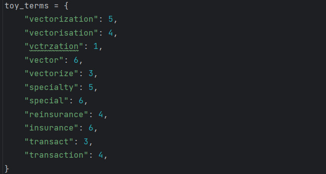
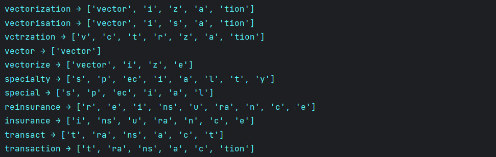
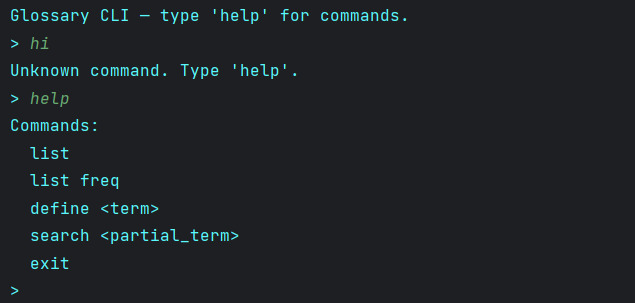
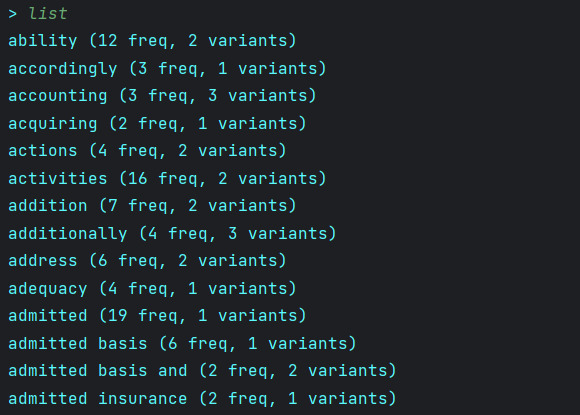
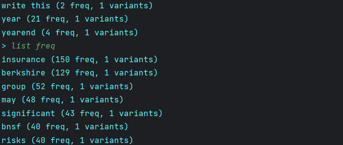
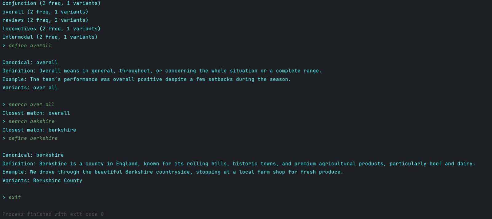

# 📘 NLP Glossary Extraction Project

This project extracts technical terms from a text corpus, consolidates variants, generates definitions and examples using a local LLM (via Ollama), and provides a command-line interface for exploring the resulting glossary.

---

## 📄 Corpus Explanation

The input corpus consists of **three plain-text `.txt` documents** containing domain-specific language (financial one in this case). These documents were parsed to identify candidate technical terms using:

- Regular expressions for:
  - Multi-word expressions
  - `snake_case` and `CamelCase`
  - Acronyms and abbreviations
- Frequency-based filtering to eliminate common stopwords
- Levenshtein distance clustering to merge spelling variants (e.g., `vectorisation` → `vectorization`)
- Tiny Byte-Pair Encoding (BPE) to analyze subword patterns

---

## 🧠 Term Definition (LLM Integration)

The script `define_terms.py` sends prompts to a local LLM using **Ollama's REST API** to generate:

- A concise definition (≤ 40 words)
- A short example sentence (≤ 25 words)
- A filtered list of real variants

Model tested: `gemma3:latest`. Responses are parsed and added to `glossary_filled.json`.

---

## 🛠️ Scripts Overview

### `NLP_Project.py`

- Runs the full preprocessing pipeline:
  - Reads the corpus
  - Extracts and filters candidate terms
  - Applies variant consolidation (Levenshtein distance ≤ 3)
  - Applies a simplified BPE tokenizer
  - Saves results to `glossary.json` and `filterd_term_freq.json`

### 📜 Patterns Used

| Pattern Type        | Regex Pattern                                                             | Description |
|---------------------|----------------------------------------------------------------------------|-------------|
| **CamelCase**       | `\\b[A-Z][a-z]+(?:[A-Z][a-z]+)+\\b`                                          | Matches identifiers like `DeepLearning`, `TradeFinance`, etc. |
| **snake_case**      | `\\b[a-z]+(?:_[a-z]+)+\\b`                                                   | Matches identifiers like `risk_adjusted`, `insurance_policy`, etc. |
| **ABBREVIATIONS**   | `\\b[A-Z]{2,}\\b`                                                            | Matches all-uppercase abbreviations (≥2 letters), like `AI`, `NLP`, `SEC`, `IRS`. |
| **Multi-word Terms**| `\\b(?:[a-z]{3,}\\s+){1,3}[a-z]{3,}\\b` <br> *(with `re.IGNORECASE`)*         | Matches phrases like `global financial system`, `insurance risk factor`, etc. |
| **Single Words**    | `\\b[a-zA-Z_]{3,}\\b`                                                        | Matches all standalone words ≥3 characters (includes underscores). |

---

### 📁 Corpus Parsing Logic

Each `.txt` file in the `corpus/` folder is processed with the following logic:

```python
for filename in os.listdir(corpus_folder):
    if filename.endswith('.txt'):
        with open(os.path.join(corpus_folder, filename), 'r', encoding='utf-8') as file:
            text = file.read()
            all_terms.extend(camel_case_pattern.findall(text))
            all_terms.extend(snake_case_pattern.findall(text))
            all_terms.extend(abbreviation_pattern.findall(text))
            all_terms.extend(multiword_pattern.findall(text))
            all_terms.extend(single_word_pattern.findall(text))
```
###  Variant Consolidation

Having the terms ready, using Levenshtein were clustered if they have a similarity of n <= 3:

```python
for i, term in enumerate(terms):
    if term in visited:
        continue
    cluster = [term]
    visited.add(term)
    for j in range(i + 1, len(terms)):
        other = terms[j]
        if other not in visited and Levenshtein.distance(term, other) <= 3:
            cluster.append(other)
            visited.add(other)
    clusters.append(cluster)
```

###  BPE Failed Application

Although BPE was applied to attempt meaningful word segmentation, there weren't enough repetitions to achieve a satisfactory result. However, this does not mean the code doesn't work, as it was tested with a sample corpus and produced satisfactory results.

```python
def apply_bpe(word, merges):
    tokens = list(word) + ['</w>']
    merge_pairs = {pair: ''.join(pair) for pair in merges}

    while True:
        pairs = [(tokens[i], tokens[i + 1]) for i in range(len(tokens) - 1)]
        match = None
        for pair in pairs:
            if pair in merge_pairs:
                match = pair
                break
        if not match:
            break
        i = 0
        while i < len(tokens) - 1:
            if tokens[i] == match[0] and tokens[i + 1] == match[1]:
                tokens = tokens[:i] + [match[0] + match[1]] + tokens[i + 2:]
                break
            i += 1
    return tokens[:-1]
```
Evidence:


---

### `define_terms.py`

- Loads `glossary.json` and filters each entry through a local LLM
- Sends carefully crafted prompts to generate definitions and examples
- Returns strict JSON and updates:
  - `"definition"`  
  - `"example"`  
  - `"variants"` → filtered by semantic similarity
- Outputs: `glossary_filled.json`

Levenshtein produced non-sense variants, so LLM had the extra work of filtering them, so the prompt finished like this:
```python
prompt = (
        f"You are an expert glossary assistant. Given the glossary term \"{term}\" and a list of possible variants {variants}, "
        "identify only the variants that are legitimate spelling variants, inflections, or abbreviations of the term. "
        "Then generate a concise definition (maximum 40 words) and a short example sentence (maximum 25 words). "
        "Do not use markdown formatting or code blocks. Only return raw JSON."
        "Respond ONLY in valid JSON format:\n"
        '{\n'
        '  "definition": "<definition here>",\n'
        '  "example": "<example sentence here>",\n'
        '  "real_variants": ["..."]\n'
        '}\n'
        f'Term: "{term}".'
    )
```
The "Do not use markdown" instruction was added because gemma3 was formatting in markdown the answers and the script needed raw json, but still it didn't work. The json needed to be extracted using regex:
```python
data = response.json()["response"].strip()
            if data.startswith("```json") or data.startswith("```"):
                data = data.strip("`")
                data = re.sub(r"^json\s*", "", data, flags=re.IGNORECASE).strip()
            if not data:
                print(f"⚠️ Empty response for term '{term}'")
                return "", "", []
            print(f"📥 Raw response for '{term}': {data}")
            result = json.loads(data)
```
---

### `CLI.py`

An interactive terminal interface for exploring the glossary.

#### Available commands:
- `list` — Show terms as-is (unsorted)
- `list freq` — Show terms sorted by frequency
- `define <term>` — View definition, example, canonical form, and variants
- `search <partial>` — Fuzzy match using Levenshtein distance
- `exit` — Close the CLI

Only terms that have been successfully defined by the LLM are shown.

CLIENT usage examples:




---

## ✅ How to Use

1. **Extract terms**
   ```bash
   python NLP_Project.py
    ```
2. **Generate definitions**
   ```bash
   python define_terms.py
    ```
3. **Explore the glossary**
   ```bash
   python CLI.py
    ```
